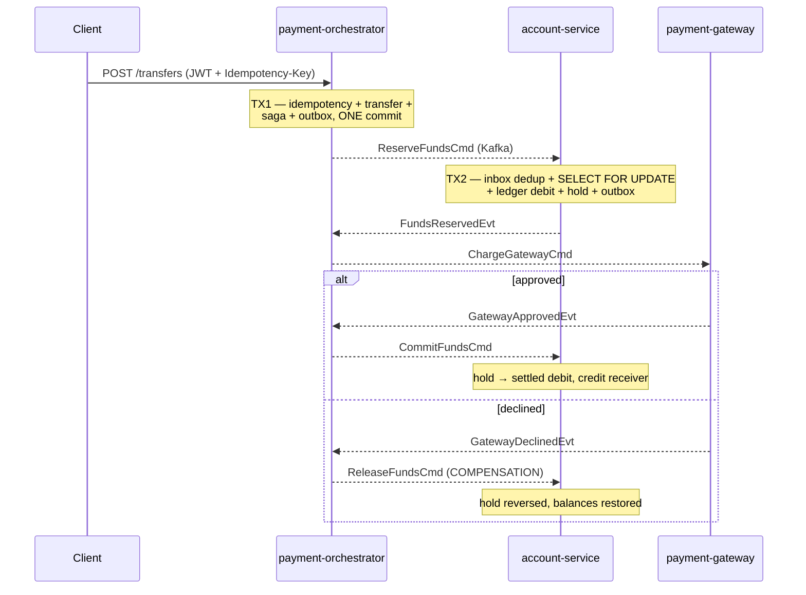

# Distributed Payment Engine

A fault-tolerant money-transfer system across three Spring Boot microservices, built to make one
guarantee hold under failure:

> **Money is never created and never destroyed. Only moved.**

> [!NOTE]
> **Status: in progress — M0 of 10 complete.** This README describes the target system; the
> milestone table below is the honest state of what is actually built. Nothing is claimed here
> that isn't in the commit history.

---

## The problem

Alice has ₹1000. Bob has ₹500. Alice sends Bob ₹300. In a single database this is one ACID
transaction and it is trivial. Split across three independently-failing services, every one of
these becomes possible:

- The account service crashes after debiting Alice, before crediting Bob → **₹300 vanishes**
- The network drops the credit message → **₹300 vanishes**
- The network *delays* it, the client retries, it lands twice → **Bob gets ₹600**
- Two concurrent transfers both read a stale balance → **Alice goes negative**
- The external processor times out → **you cannot know whether it succeeded**

This project implements the standard industrial answer to each.

## How correctness is proven

Not by HTTP 200s. By a **double-entry ledger** where creating money is structurally impossible,
plus five invariants asserted after every chaos scenario and load run:

```
I1  SUM(ledger_entries.amount) = 0                       global double-entry balance
I2  accounts.balance = SUM(its ledger_entries)           denormalized column agrees with truth
I3  SUM(balances) + SUM(active holds) is constant        conservation across a run
I4  no saga non-terminal after quiescence                nothing stuck, no stranded money
I5  no account balance < 0                               no overdraft under concurrency
```

## Architecture



| Service | Port | Owns |
|---|---|---|
| `payment-orchestrator` | 8081 | Public API, SAGA state machine, idempotency gate |
| `account-service` | 8082 | The money — double-entry ledger, holds, row-level locking |
| `payment-gateway` | 8083 | Simulated external PSP with runtime-tunable fault injection |

Every service also owns its own `outbox` and `inbox` tables.

## Patterns implemented

- **SAGA orchestration** with compensating transactions — no 2PC, no distributed locks
- **Transactional Outbox + Inbox** — defeats the dual-write problem; at-least-once delivery with
  idempotent consumers for **effectively-once processing**
- **Idempotency** via a Postgres unique constraint on `(client_id, idempotency_key)`; Redis is a
  fast-path cache only and is deliberately **not** load-bearing
- **Pessimistic row locking** with deterministic lock ordering, making deadlock structurally
  impossible rather than merely detected
- **Retry with exponential backoff + jitter**, and a **Dead Letter Queue** with replay
- **Chaos suite** of 8 injected-failure scenarios, each asserting the invariants
- **Load tested** to 1,000 concurrent transfers with conservation verified

### A note on "exactly-once"

This system does **not** provide exactly-once delivery — that is impossible over an unreliable
network (the Two Generals Problem). It provides at-least-once delivery with idempotent consumers,
giving effectively-once *processing*. The distinction is deliberate and is explained in
[`progress.md`](progress.md).

## Stack

Java 21 · Spring Boot 4.1.1 · PostgreSQL · Flyway · Kafka/Redpanda · Redis ·
Prometheus + Grafana · OpenTelemetry + Jaeger · Testcontainers · k6 · Docker Compose · Kubernetes

## Progress

| # | Milestone | Status |
|---|---|---|
| M0 | Environment + multi-module skeleton | ✅ build green |
| M1 | Ledger core — double-entry, `FOR UPDATE`, deadlock ordering | ⬜ |
| M2 | Transactional outbox + Kafka + inbox dedup | ⬜ |
| M3 | SAGA orchestration + compensation + timeouts | ⬜ |
| M4 | Idempotency + DLQ | ⬜ |
| M5 | JWT security | ⬜ |
| M6 | Observability — metrics, dashboards, tracing | ⬜ |
| M7 | Chaos suite — 8 scenarios | ⬜ |
| M8 | k6 load test to 1,000 concurrent | ⬜ |
| M9 | Docs + README polish | ⬜ |
| M10 | Kubernetes + Helm | ⬜ |

## Build

Requires Docker. Nothing else — the Maven wrapper is committed, and k6/psql run as containers.

```bash
docker compose -f infra/docker-compose.yml up -d --build
```

Brings up PostgreSQL and all three services. Health checks gate startup, so the command returns
only once everything is actually serving:

```bash
curl -s localhost:8081/actuator/health   # payment-orchestrator
curl -s localhost:8082/actuator/health   # account-service
curl -s localhost:8083/actuator/health   # payment-gateway
```

To build or test without Docker Compose:

```bash
./mvnw -B -ntp compile     # no Maven install needed — wrapper included
./mvnw -B -ntp verify      # full build + tests (requires Docker for Testcontainers)
```

## Engineering log

[**`progress.md`**](progress.md) records the milestone status, the key design decisions and the
reasoning behind each (orchestration over choreography, why idempotency rests on a Postgres
constraint rather than a Redis lock, why "exactly-once" is not claimed), the five correctness
invariants, and a per-milestone log of what was built and what broke.
