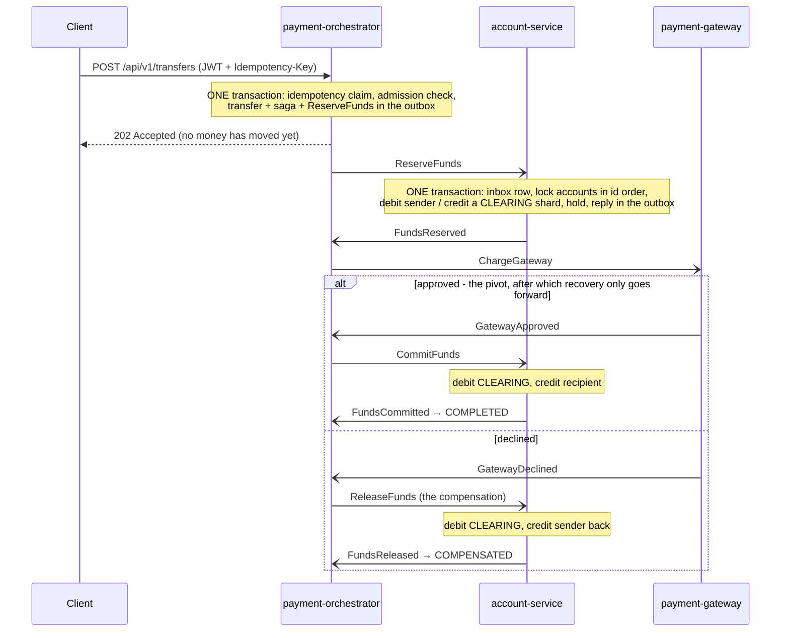

# Distributed Payment Engine

A fault-tolerant money-transfer system across three Spring Boot microservices, built to make one
guarantee hold under failure:

> **Money is never created and never destroyed. Only moved.**

Saga orchestration, a transactional outbox and inbox, idempotent consumers, a double-entry ledger,
and a chaos suite and load test that judge the system by what is in its ledger rather than by the
HTTP status codes it returned.

**[Send a payment, then break it → goutham-payment-engine.vercel.app](https://goutham-payment-engine.vercel.app/)**

A second implementation of this design, running: the same saga, the same double-entry ledger, the
same outbox and inbox, against a real PostgreSQL database. Payments you send write real rows and
the invariants on the page are SQL queries over them. Throw a fault switch — decline the card,
kill the broker, deliver every message twice, lose the commit — and watch what the ledger says.

The switch worth finding is **Lose the commit, once** together with **Unwind it**: the card is
charged, the deadline unwinds the payment anyway, and I1–I5 all stay green while S2 goes red. That
is the defect the chaos suite found, reproducible in about fifteen seconds. Source in
[`web/`](web/); what is faithful to the Java system and what is not is set out in
[`web/README.md`](web/README.md).

> [!NOTE]
> **Status: M0–M10 complete, including the optional M10: Kubernetes + Helm on a one-node kind
> cluster ([ADR 0013](docs/adr/0013-kubernetes.md)).**
> Every result below comes from a run recorded in [`progress.md`](progress.md), with the command
> that produced it.

---

## The problem

Alice has ₹1000. Bob has ₹500. Alice sends Bob ₹300. In a single database this is one ACID
transaction and it is trivial. Split across three independently-failing services, every one of
these becomes possible:

- The account service crashes after debiting Alice, before crediting Bob → **₹300 vanishes**
- The network drops the credit message → **₹300 vanishes**
- The network *delays* it, the client retries, it lands twice → **Bob gets ₹600**
- Two concurrent transfers both read a stale balance → **Alice goes negative**
- The external processor times out → **nobody knows whether it succeeded**

This project implements the standard industrial answer to each, and then breaks it on purpose to
find out where the answers were incomplete.

## How correctness is proven

Not by HTTP 200s. By a **double-entry ledger**, where creating money breaks a global sum, and five
invariants asserted after every chaos scenario and every load run:

```
I1  SUM(ledger_entries.amount_minor) = 0              global double-entry balance
I2  accounts.balance_minor = SUM(its ledger entries)  the stored balance agrees with the ledger
I3  SUM(customer balances) + SUM(active holds)        money is conserved across a run
      is constant
I4  no saga in a non-terminal state after quiescence  nothing stuck
I5  no CUSTOMER account balance_minor < 0             no overdraft under concurrency
```

Money is a `BIGINT` count of paise, never a float. I5 is scoped to customer accounts because money
enters the ledger by being debited from a single issuance account, whose balance is negative by
design.

**The five invariants turned out not to be enough.** The chaos suite's first run found five saga
defects. Only one scenario tripped any of I1–I5 (a saga left stuck, I4); the rest passed all five
while money sat stranded in CLEARING or a PSP charge had no transfer behind it. Four more checks,
each joining two services' databases, now run alongside them:

| | Check | What it catches |
|---|---|---|
| S1 | no `ACTIVE` hold after quiescence | money parked in CLEARING with no live saga to move it — I3 counts it as conserved |
| S2 | every approved PSP charge belongs to a `COMPLETED` transfer | a customer refunded in the ledger while the card network kept the charge |
| S3 | every `COMPLETED` transfer has an approved charge | money moved without the PSP agreeing |
| S4 | no transfer `PENDING` under a terminal saga | a customer told "processing" about something that has finished |

```bash
./scripts/verify-invariants.sh baseline   # record the current total as I3's reference point
./scripts/verify-invariants.sh            # I1-I5 and S1-S4 against the running stack; non-zero on any failure
```

I3 is a statement about two instants, so it needs a baseline, and it must be recorded *after*
opening funded accounts: funding an account issues new money, and I3 would correctly report the
difference as a violation. Without a baseline I3 reports as skipped, never as passed.

## Results

### Chaos: eight injected faults against the real deployment

Each scenario states a hypothesis, injects one fault into the running Compose stack (SIGKILL,
`docker pause`, a network cut aimed at an open transaction, a PSP that declines, times out or
answers twice), waits for quiescence, and asserts both the invariants and the outcome the design
promises.

| # | Fault | Result |
|---|---|---|
| 1 | Broker killed while transfers are accepted (15 s, and 45 s past the saga deadline) | held — the API keeps accepting; commands wait in the outbox |
| 2 | account-service SIGKILLed before the reserve, and after the charge | held — after the charge the saga completes, before it the sender is made exactly whole |
| 3 | Orchestrator killed with committed, unpublished commands | held — every command published once; no saga timed out while the restarted service was deaf |
| 4 | Gateway declines everything | held — every transfer compensated, each sender restored exactly, per account |
| 5 | Gateway answers twice; then goes silent and its dead letters are replayed | held — no double credit; the replay charged nobody |
| 6 | One `Idempotency-Key` sent 100 times at once, with Redis on and off | held — exactly one transfer, every caller told about it |
| 7 | 90 concurrent transfers from an account with room for 60 | held — exactly 60 completed, 30 refused, balance exactly 0, zero deadlocks |
| 8 | account-service cut off inside an open transaction (and killed while cut off) | held — the orphaned transaction reaped by Postgres 27–41 s after the cut |

**What the suite found**, in a system whose unit and integration tests were all green:

- A timeout *after* the gateway charge compensated like one before it, refunding the customer out
  of the system's own books while the PSP kept the charge. The charge is now the saga's pivot:
  before it recovery runs backward, after it only forward. The same scenario showed a participant
  answering a command for an already-settled hold with silence; it now replies with what actually
  happened to the hold.
- A timeout *before* the reserve sent nothing, and a late reserve then stranded money in CLEARING
  forever. Compensations are now addressed by transfer id and leave a tombstone, so they commute
  with the step they compensate, whichever arrives first.
- A replayed dead letter charged a transfer that had already been compensated — fixed the same way,
  at the gateway.
- A restarted orchestrator timed out sagas whose replies were already waiting for it. The sweeper
  now waits until the reply listener holds its partitions.
- A transaction orphaned by a network cut held its row locks, and the restarted service's only
  consumer blocked behind it; left alone it would have lasted until TCP keepalive gave up, two
  hours. `idle_in_transaction_session_timeout` (30 s) now lets Postgres reap it without the client.

The money those defects had stranded was repaired through a reconciliation endpoint that can only
finish a compensation, never originate a movement ([ADR 0008](docs/adr/0008-reconciliation-finishes-compensations.md)).

**One open issue, recorded honestly:** after a broker restart, a Kafka consumer occasionally stops
fetching while its group reports it healthy. It reproduced in 4 of 10 restarts on Redpanda and 0 of
13 on Apache Kafka, with the same client and code. The root cause is not established. Since the
fixes above it strands no money; an alert (`KafkaConsumerFetchSpin`) catches it, and a service restart
clears it. Details in [`chaos/README.md`](chaos/README.md) and `progress.md`.

### Load: 1,000 concurrent users

k6 in a container on the Compose network, judged after the run by `saga_instances` and the
invariants. The API's own latency cannot see a collapse. In the first run it answered 248,628
requests with zero errors, and by the end of that run every saga it accepted was timing out.

| 1,000 users (closed model) | Think 30–90 s | Think 5–15 s (≈ 2× capacity) |
|---|---|---|
| Offered / accepted | ~16/s / 13.6/s | ~74/s / 33.4/s |
| Completed | **7,307 of 7,307** | **17,974 of 17,974 accepted** |
| Create p99 | 58 ms | 228 ms |
| Settle p99 | 3.55 s | server-side ≤ 5.4 s in every window; 17.5 s for the customer including back-off |
| Refused with 503 | 0 | 48,345 (22.7% of payments abandoned after five tries) |
| Latency SLO | met | missed — no system meets it at twice capacity |
| I1–I5, S1–S4 | pass | pass |

The overloaded run is the interesting one. The system stays correct and stays fast *for what it
accepts*, and turns the excess away up front instead of accepting it and timing it out 30 s later.

**How it got there.** The first load test found a metastable collapse: past ~15 transfers/s, waiting
customers' status polls took every database connection the saga pipeline needed, sagas timed out,
their compensations added more work, and the system stayed down after the load dropped — with every
paisa conserved. The fixes, each measured before and after: admission control bounded by sagas in
flight and a request bulkhead ([ADR 0009](docs/adr/0009-admission-control-and-the-request-bulkhead.md)),
consumers per partition, a pipelined outbox relay, CLEARING sharded across eight accounts
([ADR 0010](docs/adr/0010-sharded-clearing.md)), and a region-by-region JVM memory budget with G1
([ADR 0012](docs/adr/0012-a-jvm-memory-budget.md)). Capacity went from ~15/s to ~38/s, where it is
now set by the simulated payment provider (three concurrent calls of ~75 ms each). Full method in
[`loadtest/README.md`](loadtest/README.md).

### Kubernetes: a rolling deploy under load

The same k6 script, run as a Job inside a kind cluster against the Service, while every Deployment is
restarted in turn - two orchestrator replicas, one each of the others. Judged the same way, from
`saga_instances` and the invariants:

| Disruption, under ~4.6 payments/s | Failed requests | Sagas completed | Settle p99 | I1–I5, S1–S4 |
|---|---|---|---|---|
| Rolling restart of all three services | **0 of 6,874** | 1,298 of 1,298 | 3.13 s | pass |
| The same, without the 5 s `preStop` sleep | 4 of 6,834 | 1,317 of 1,317 | 3.12 s | pass |
| SIGKILL of an orchestrator (a crash, not a stop) | 2 of 7,343 | 1,139 of 1,139 | **42.5 s** | pass |
| SIGSTOP of an orchestrator, saga deadline 30 s | 9 of 6,279 | **1,053 of 1,066** | 31.0 s | pass |
| The same, saga deadline 60 s | 0 of 6,138 | 1,050 of 1,050 | 39.0 s | pass |

The second row is the race between SIGTERM and the pod leaving the Service's endpoints, measured:
every error was `connection refused` at the instant an old pod was signalled. The third is a crashed
consumer holding its partitions until its session times out (45 s). The fourth row is what that
does when the surviving replica keeps sweeping: thirteen payments whose replies had already been
sent, sitting unread on the frozen replica's partitions, were timed out and failed. Money stayed
correct; customers were told the wrong thing. The saga deadline now outlasts an orphaned partition
(60 s), and the same freeze fails nothing.
[ADR 0013](docs/adr/0013-kubernetes.md) has what else Compose had been doing implicitly: the
management port's network boundary (now a NetworkPolicy, proven by a test that must see a refusal),
a signing key two replicas can share, pod-level scraping, and gauges that two replicas would have
double-counted.

## Architecture

| Service | API port | Database | Owns |
|---|---|---|---|
| `payment-orchestrator` | 8081 | `payments_db` | the public API, the saga state machine, idempotency, token issuing |
| `account-service` | 8082 | `accounts_db` | the money — double-entry ledger, holds, CLEARING |
| `payment-gateway` | 8083 | `gateway_db` | a simulated external PSP with runtime-tunable failure injection |

Each service owns its database, its own `outbox` and `inbox` tables, and nothing else. No service
reads another's database; they talk only through Kafka topics.



Every arrow between services is a row written to an outbox in the same transaction as the state
change it reports, published by a relay, and deduplicated on arrival by an inbox row written in the
consumer's transaction. A saga that hears nothing is found by a sweeper at its deadline. Before the
charge it is compensated, and if the charge request had already gone out, a `VoidCharge` follows it
in case it is still on its way. After the charge, `CommitFunds` is sent again.

Money in flight lives in a CLEARING account, never nowhere. Commit and release both write the same
ledger leg — `(transfer, clearing account, DEBIT)` — under a UNIQUE constraint, so completing and
compensating the same transfer are mutually exclusive in the schema, not by the orchestrator's
promise.

## What is implemented

| Pattern | Where to read about it |
|---|---|
| **Saga orchestration** with compensating transactions — no 2PC, no distributed locks | [ADR 0001](docs/adr/0001-orchestration-not-choreography.md) |
| **Transactional outbox + inbox**: at-least-once delivery with idempotent consumers, for effectively-once processing | [ADR 0004](docs/adr/0004-shared-messaging-library.md) |
| **Idempotency keys** on a Postgres unique constraint; Redis is a fast path and deliberately not load-bearing | [ADR 0002](docs/adr/0002-idempotency.md) |
| **Double-entry ledger** with pessimistic row locks in one global order, so deadlock is structurally impossible | `progress.md`, M1 |
| **Versioned message contracts** and the rules for evolving them | [ADR 0003](docs/adr/0003-shared-contracts.md) |
| **Retry with bounded backoff and a dead letter queue**, replayed through the inbox so a replay is safe either way | `progress.md`, M4 |
| **RS256 JWT** with per-account authorization; an operator sees everything and moves no money | [ADR 0005](docs/adr/0005-jwt-authentication.md) |
| **Metrics, dashboards, alerts and distributed tracing**, with trace context carried through the outbox | [ADR 0006](docs/adr/0006-trace-context-in-the-outbox.md) |
| **A demo console**: a transfer's stage timeline, the invariants, and fault-injection controls | [ADR 0007](docs/adr/0007-the-console-is-a-reader.md) |
| **Reconciliation** that finishes a compensation and can never originate a movement | [ADR 0008](docs/adr/0008-reconciliation-finishes-compensations.md) |
| **Admission control and a request bulkhead**, sized by Little's law and then by measurement | [ADR 0009](docs/adr/0009-admission-control-and-the-request-bulkhead.md) |
| **A sharded CLEARING account**, each hold recording its shard | [ADR 0010](docs/adr/0010-sharded-clearing.md) |
| **A test suite with no route to the running stack** | [ADR 0011](docs/adr/0011-tests-have-no-route-to-the-running-stack.md) |
| **A JVM memory budget**, G1, and GC logs always on | [ADR 0012](docs/adr/0012-a-jvm-memory-budget.md) |
| **Kubernetes + Helm**: probes that ignore dependencies, NetworkPolicies proven enforced, a rolling deploy that loses nothing | [ADR 0013](docs/adr/0013-kubernetes.md) |

### A note on "exactly-once"

This system does **not** provide exactly-once delivery — that is impossible over an unreliable
network (the Two Generals Problem). The relay cannot make "the broker acknowledged" and "the row is
marked published" atomic, so a crash between them republishes. It provides at-least-once delivery
with idempotent consumers, giving effectively-once *processing*.

## Quick start

Requires Docker, and a POSIX shell with `curl` for the scripts (Git Bash works on Windows). Nothing
else: the Maven wrapper is committed, and k6 and psql run as containers. The stack is sized for a
16 GB laptop with about 8 GB given to Docker.

```bash
docker compose -f infra/docker-compose.yml up -d --build
```

This brings up PostgreSQL, Redpanda, Redis, the three services, Prometheus, Grafana, Jaeger and the
console. Health checks order the startup, but the command returns before the services are ready:
from a fresh clone they report healthy about a minute later. Wait for `(healthy)` on all ten before
the steps below:

```bash
docker compose -f infra/docker-compose.yml ps
```

| | |
|---|---|
| **Console** | <http://localhost:8084> — sign in as `alice` / `alice-password`, or `operator` / `operator-password` for the system view and fault controls |
| Grafana | <http://localhost:3000> (anonymous; lands on the payments dashboard) |
| Prometheus | <http://localhost:9090> |
| Jaeger | <http://localhost:16686> |

These credentials are a development directory standing in for an identity provider. They are fake,
and in the repository on purpose.

### One transfer, by hand

```bash
# An operator opens accounts; customers cannot.
OP=$(./scripts/token.sh operator)
curl -s -X POST localhost:8082/accounts -H "Authorization: Bearer $OP" \
     -H 'Content-Type: application/json' \
     -d '{"ownerId":"alice","currency":"INR","openingBalanceMinor":100000}'
curl -s -X POST localhost:8082/accounts -H "Authorization: Bearer $OP" \
     -H 'Content-Type: application/json' \
     -d '{"ownerId":"bob","currency":"INR","openingBalanceMinor":0}'
# -> {"id":"<ALICE>",...,"balanceMinor":100000}   {"id":"<BOB>",...,"balanceMinor":0}

# Funding issued ₹1000 of new money, so take the I3 baseline now, before any transfer.
./scripts/verify-invariants.sh baseline

# Alice pays Bob ₹300.00. The answer is 202: accepted, not done.
T=$(./scripts/token.sh)
curl -s -X POST localhost:8081/api/v1/transfers -H "Authorization: Bearer $T" \
     -H 'Idempotency-Key: my-first-transfer' -H 'Content-Type: application/json' \
     -d '{"fromAccountId":"<ALICE>","toAccountId":"<BOB>","amountMinor":30000,"currency":"INR"}'
# -> 202 {"transferId":"<ID>",...,"status":"PENDING","sagaStatus":"STARTED"}

# Send the same request again: the original transfer comes back, marked as a replay.
# -> 202, header Idempotency-Replayed: true, the same transferId

# A few seconds later
curl -s localhost:8081/api/v1/transfers/<ID> -H "Authorization: Bearer $T"
# -> "status":"COMPLETED","sagaStatus":"COMPLETED"
curl -s localhost:8081/api/v1/transfers/<ID>/timeline -H "Authorization: Bearer $T"
# -> every stage: command and reply message ids, relay lag, step latency, and the trace id

./scripts/verify-invariants.sh
# -> PASS I1 ... I5, S1 ... S4 - "All invariants hold."
```

Alice asking for Bob's account gets a 404, not a 403: on the read path, a 403 would confirm to
someone guessing ids that the account exists.

### The chaos suite, the load test, and the invariants

```bash
./chaos/04-gateway-declines-everything.sh   # one scenario (the stack must be up and at rest)
./chaos/run-all.sh                          # all of them, ~10 min; exit 0 held, 1 refuted, 2 refused to start
./loadtest/run.sh                           # PROFILE=smoke | knee | users
./scripts/verify-invariants.sh              # I1-I5 and S1-S4, any time
./scripts/reconcile.sh                      # dry run: which transfers need reconciling (--apply to do it)
```

A scenario refuses to start unless the system is at rest (no saga in flight, nothing unpublished in
any outbox, zero consumer lag), and only one scenario or load run can hold the stack at a time.

To run the same code against Apache Kafka instead of Redpanda:

```bash
docker compose -f infra/docker-compose.yml stop redpanda
docker compose -f infra/docker-compose.yml -f infra/docker-compose.kafka.yml up -d
```

### On Kubernetes

A Helm chart and a one-node kind cluster, built and loaded by one script. It cannot run beside the
Compose stack (they publish the same host ports), so stop that first:

```bash
docker compose -f infra/docker-compose.yml stop
./k8s/up.sh                      # needs kind, kubectl, helm, openssl
./k8s/verify-netpol.sh           # every forbidden connection must be refused
./k8s/rollout-under-load.sh      # restart every Deployment under load; DISRUPT=kill for a crash
```

Details in [`k8s/README.md`](k8s/README.md).

### Build and test without Compose

```bash
./mvnw -B -ntp verify                      # all modules; Testcontainers needs Docker running
./mvnw -pl account-service -am test        # one module (-am builds the shared modules it needs)
cd ui && npm ci && npm run dev             # the console's dev server on :8085
```

Each service also listens on a management port (9091/9092/9093) carrying the actuator, which
Compose deliberately does not publish — that network boundary is what lets Prometheus scrape
without a credential. (On Kubernetes, where every pod can reach every port, a NetworkPolicy has to
draw it.) Reach it through a container:

```bash
docker exec dpe-orchestrator wget -qO- http://localhost:9091/actuator/health
```

## Repository layout

```
common-events/          message contracts (records only) and topic names
common-messaging/       outbox, relay, inbox, dead-letter mechanics - no domain types
common-security/        token validation, shared by all three services
payment-orchestrator/   the API, the saga, idempotency, admission control, token issuing
account-service/        the ledger, holds, CLEARING
payment-gateway/        the simulated PSP
ui/                     the console (React, served by nginx; not a Maven module)
infra/                  Docker Compose, Prometheus rules, Grafana dashboards, Redpanda config
chaos/                  the eight scenarios and their harness
loadtest/               k6 script and runner
scripts/                invariants, reconciliation, token helper
k8s/                    kind cluster, Helm chart, stateful-tier manifests, rollout and policy tests
docs/adr/               architecture decision records
```

## Documentation

- [**Architecture decision records**](docs/adr/README.md) — thirteen decisions, each with the options
  rejected, the evidence, and when to revisit it.
- [**`progress.md`**](progress.md) — the engineering log: every milestone, what broke and why, and
  the exact commands behind every number in this README.
- [`chaos/README.md`](chaos/README.md) and [`loadtest/README.md`](loadtest/README.md) — how the
  harnesses work and what they refuse to do.

## Stack

Java 21 · Spring Boot 4.1 · PostgreSQL 16 · Flyway · Kafka API (Redpanda by default, Apache Kafka
supported) · Redis · Prometheus + Grafana · OpenTelemetry + Jaeger · Testcontainers · k6 · React ·
Docker Compose · Kubernetes (kind) + Helm

## Progress

| # | Milestone | Status |
|---|---|---|
| M0 | Environment + multi-module skeleton + Compose stack | ✅ done |
| M1 | Ledger core — double-entry, `FOR UPDATE`, deadlock-safe lock ordering | ✅ done |
| M2 | Transactional outbox + Kafka + inbox dedup | ✅ done |
| M3 | Saga orchestration + compensation + timeouts | ✅ done |
| M4 | Idempotency keys + retry + dead letter queue | ✅ done |
| M5 | JWT authentication and per-account authorization | ✅ done |
| M6 | Observability — metrics, dashboards, tracing, read endpoints | ✅ done |
| M6.5 | Demo console | ✅ done |
| M7 | Chaos suite — 8 scenarios | ✅ done |
| M8 | Load test — 1,000 concurrent users | ✅ done |
| M9 | Documentation, ADRs, README | ✅ done |
| M10 | Kubernetes + Helm (optional) | ✅ done |
